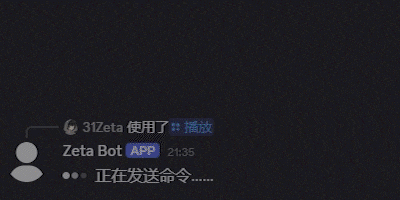
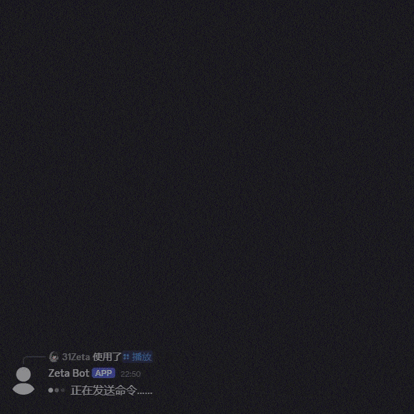
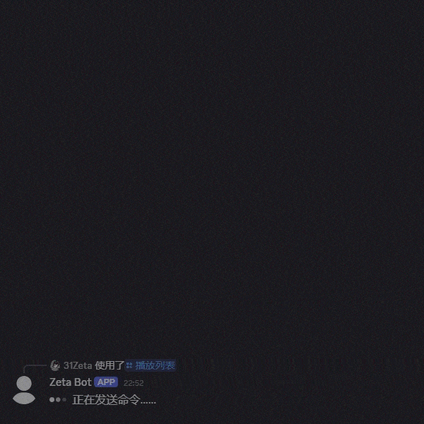

# Zeta Discord Bot
[中文](../README.md) | English  

A Discord bot built with Pycord  
The author currently programs as a hobby. Please bear with any unconventional practices; feedback and suggestions are welcome.  

The bot currently supports Chinese only  

Table of contents
------------------------
- [Core Features](#core-features)
- [Run](#run)
- [Configuring Cookies for go-music-api](#configuring-cookies-for-go-music-api)

## Core Features
- Uses [go-music-api](https://github.com/guohuiyuan/go-music-api) as the backend to download and play music or audio from multiple platforms (Bilibili, NetEase Cloud Music, QQ Music, etc.) in Discord voice channels
- Plays audio from YouTube in Discord voice channels
- Supports searching for and playing content from Bilibili or YouTube directly within Discord channels
- Interactive playlists






## Run
**Please use Python 3.10–3.13**

### Downloading the Source Code and Installing Dependencies
Download the source code for the latest version from **[Releases](https://github.com/31Zeta/Zeta-DiscordBot/releases)** and extract it.  
  
Run the following command in the root directory of the extracted source code to install the dependencies:  
```
pip install -r requirements.txt
```

On Linux, you also need to install:  
```
sudo apt install libopus0
```

### Deploying go-music-api
Refer to [go-music-api](https://github.com/guohuiyuan/go-music-api#快速开始) for deployment instructions. When you start the bot later, enter the URL of your deployed service in the settings. The default is usually [http://localhost:8080](http://localhost:8080).

### Installing or Linking FFmpeg
On Windows, visit the [FFmpeg website](https://ffmpeg.org/download.html) to obtain ffmpeg.exe, or [direct download](https://www.gyan.dev/ffmpeg/builds/ffmpeg-git-full.7z) and extract ffmpeg.exe from the archive's bin folder.  
  
On Linux, you can use the ffmpeg bundled in the bin folder or obtain the latest version from the [FFmpeg website](https://ffmpeg.org/download.html).  

Place the extracted ffmpeg file in the repository's bin folder.

### Starting the Bot
Run the following command to start the bot:  
```
python main.py
```

Follow the prompts to complete the setup, and keep the window open to ensure the bot continues running.  
Consider using a daemon to prevent the bot from shutting down unexpectedly.  

### Changing Settings
To change the settings, start the bot with the following command (version 0.7.0 and later):
```
python main.py --mode=setting
```

### [Optional] yt-dlp Configuration
If you need the bot's YouTube features, enabling a JavaScript runtime for `yt-dlp-ejs` is recommended.
`yt-dlp-ejs` is already included through `yt-dlp[default]` in `requirements.txt` and will be installed automatically when you install the dependencies. For guidance on choosing and installing a runtime, see [Step 1: Install a supported JavaScript Runtime](https://github.com/yt-dlp/yt-dlp/wiki/EJS#step-1-install-a-supported-javascript-runtime).  


## Configuring Cookies for go-music-api
**Note: Once cookies are configured, all audio downloads handled by go-music-api will use the corresponding logged-in accounts to make requests, regardless of which user issues commands to the bot. Please use your own judgment and accept responsibility for any resulting account risks.**  

Most platforms require you to log in to access much of their content. You can configure cookies for go-music-api in the following ways:
- Configure cookies directly for the go-music-api service. See [Cookie 配置](https://github.com/guohuiyuan/go-music-api#cookie-配置).
- Install a cookie export extension in your browser and log in to the corresponding platform. Copy the cookies in JSON format from the extension and paste them into ``<project root>/data/cookies/<platform>.json`` (if the directory does not exist, start the bot once first).  
  The bot will transfer the cookies to ``cookies.json`` in the root directory of the go-music-api deployment.
- Run ``python go_music_qr_login.py`` and follow the prompts to scan the QR code and log in. After login, the cookies will be saved to ``<project root>/data/cookies/<platform>.json`` and transferred to ``cookies.json`` in the root directory of the go-music-api deployment.